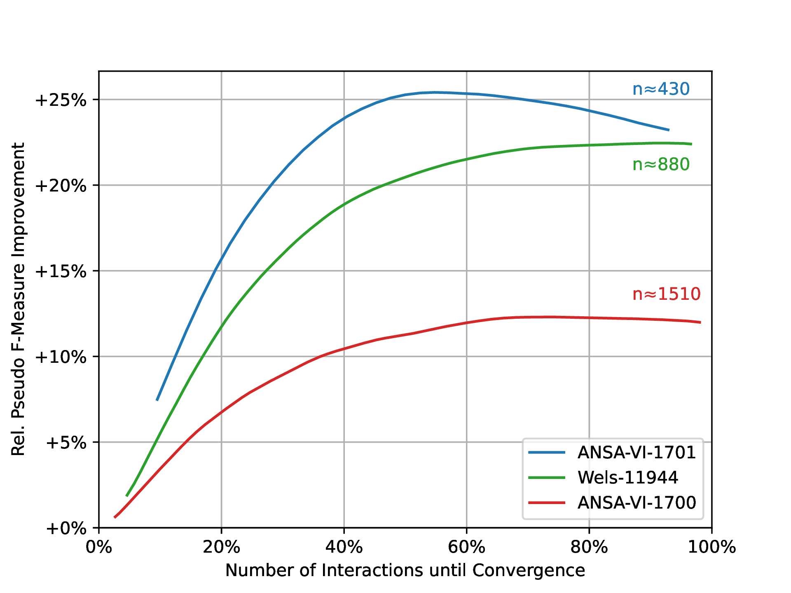

## Code to our [Paper](https://www.arxiv.org/abs/2408.03304):
# Fusing Forces: Deep-Human-Guided Refinement of Segmentation Masks @&nbsp;ICPR 2024

Note that, data will be provided at a later stage [here](https://www.oeaw.ac.at/acdh/tools/arche).

## Overview


In our interactive segmentation approach, the initial mask $\mathbf{Y}$ is refined by user inputs, either adding ($\mathbf{\Delta^+}$) or erasing ($\mathbf{\Delta^-}$) parts to better align with the ground truth $`\mathbf{Y^*}`$. A separate model, conditioned on $\mathbf{Y}$ and $\mathbf{\Delta}$, then generates a refined mask $\mathbf{Y'}$, aiming to reduce the difference to $\mathbf{Y^*}$ more effectively than the user-refined mask $\mathbf{Y^\Delta}$. Segmentation is performed at a per-patch level, with the refinement process iteratively improving correctness based on human input.

## Results



Our human-in-the-loop approach significantly improves annotation quality over manual refinement, with relative pFM gains peaking between +12% and +26%. This method quickly surpasses manual labeling, leading to better annotations earlier. However, as the process continues, the improvement slightly decreases before convergence, indicating that the network may occasionally undo parts it had previously annotated correctly.

## Data

Please, download the data and store it in the following structure:

```
STORAGE
├── train //will be created automatically
└── val   //will be created automatically

DIR_ROOT
├── ANSA-VI-1011
│   └── PS
│       ├── ANSA-VI-1011_V_N.tif
│       ├── ANSA-VI-1011_V_RHO.tif
│       ├── ...
│       ├── ANSA-VI-1011_R_N.tif
│       ├── ANSA-VI-1011_R_RHO.tif
│       └── ANSA-VI-1011_R_U.tif
├── ...
├── GT_REL //folder for ground truth annotation
│   ├── ANSA-VI-1695_R_drawings.png
│   └── ...
└── MASKS_REL
    ├── ANSA-VI-1011_R_mask.png
    └── ...
```


## Model Weights (Optional)

Click [here](https://owncloud.tuwien.ac.at/index.php/s/iYPVEWn3v6j0aZC) to download weights of already trained models and place them in ```weights```. 


## Installation

Setup the environment by typing the following:

    conda env create -f environment.yml
    conda activate etmira
    pip install -r requirements.txt

Note that this process might take some time.
Next, continue to define path variables and wandb information in ```user_config.py```, which is used for logging. 

Finally, to preprocess the raw data for training and evaluating run:

    python -m data.setup

## Training

In order to start training the base model used for the initial prediction, type the following:

    python -m train

If interested, parameters can be adjusted via command line arguments (see ```train.py```). After training, model weights will be stored under ```{WANDB_PROJECT}/{run_id}/checkpoints/epoch=*.ckpt``` to which we refer to as the ```BASE_MODEL```.

After having trained a base model, we need to train the interactive model ```INTERACTIVE_MODEL``` which aims to refine an initial segmentation mask with a human-in-the-loop paradigm. For this, run the following:

    python -m train --is_interactive True --base_model BASE_MODEL

## Inference

In order to run inference on a mirror ```MIRROR``` run the following:

    python -m eval --ckpt INTERACTIVE_MODEL --base_model BASE_MODEL --mirror MIRROR

The output will be stored in ```out/{MIRROR}```. After having run simulations on all three test mirrors, i.e. ```ANSA-VI-1700_R, ANSA-VI-1701_R, wels-11944_R```, and multiple runs (via the argument ```--seed 0```, ten runs were used in the paper), plots can be created with the notebook ```results_plot.ipynb```.

## Contact
In case you have questions or find some errors, do not hesitate to contact me rsterzinger(at)cvl.tuwien.ac.at. 

## References
Please consider citing our paper!

    @misc{sterzinger2024fusingforcesdeephumanguidedrefinement,
          title={Fusing Forces: Deep-Human-Guided Refinement of Segmentation Masks}, 
          author={Rafael Sterzinger and Christian Stippel and Robert Sablatnig},
          year={2024},
          eprint={2408.03304},
          archivePrefix={arXiv},
          primaryClass={cs.CV},
          url={https://arxiv.org/abs/2408.03304}, 
    }
